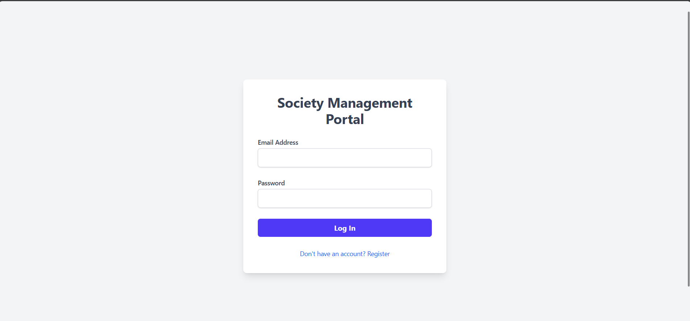
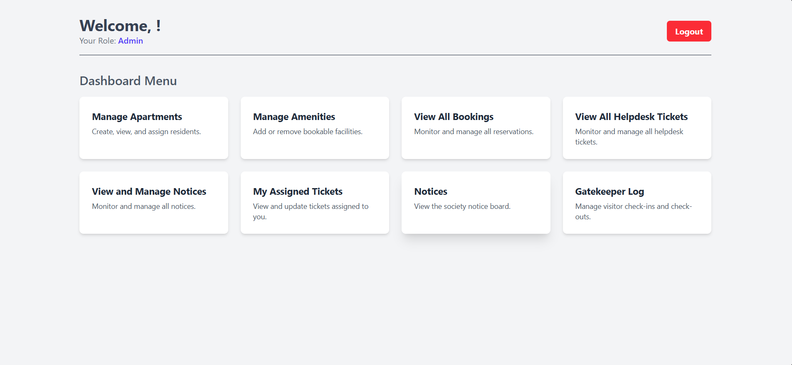
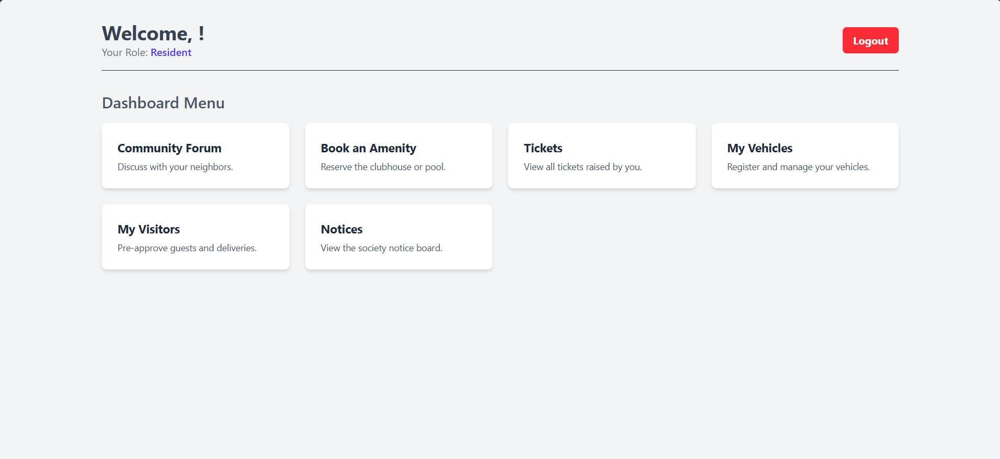
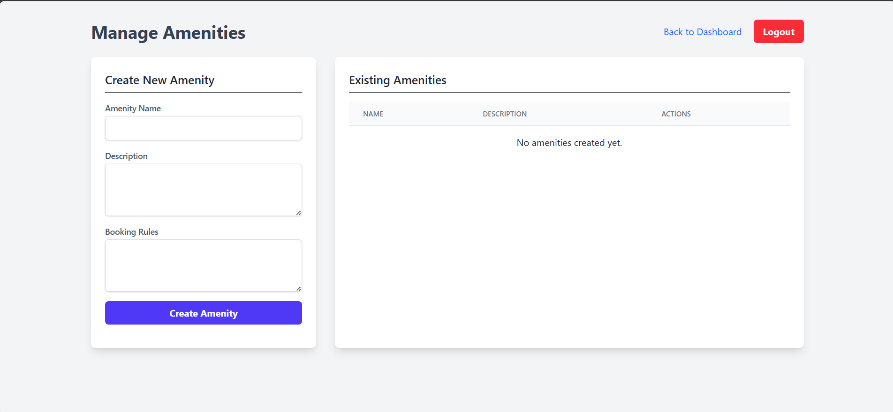

# Society Management System

A comprehensive, full-stack web application designed to streamline the daily operations and enhance community engagement within a residential society. This platform provides a centralized system for residents, administration, and staff to manage amenities, communications, visitors, and service requests efficiently.

The application features a secure, role-based architecture serving distinct functionalities for **Admins**, **Residents**, **Staff**, and **Security** personnel, with a responsive, mobile-first user interface.

## Table of Contents

- [Key Features](#key-features)
- [Screenshots](#screenshots)
- [Technology Stack](#technology-stack)
- [System Architecture](#system-architecture)
- [Getting Started](#getting-started)
  - [Prerequisites](#prerequisites)
  - [Installation & Setup](#installation--setup)
- [API Endpoints](#api-endpoints)

- [Future Enhancements](#future-enhancements)


## Key Features

### For Residents:
- **Secure Registration & Login:** JWT-based authentication for secure access.
- **Amenity Booking:** View and book shared facilities like the clubhouse and pool, with built-in conflict prevention.
- **Community Forum:** Create posts and engage in discussions with fellow residents through comments.
- **Help Desk:** Submit and track the status of service requests (e.g., plumbing, electrical).
- **Visitor Management:** Pre-approve visitors to ensure smooth and secure entry.
- **Vehicle Registration:** Manage personal vehicle details for security purposes.
- **Notice Board:** View all important announcements from the administration.

### For Admins & Staff:
- **Role-Based Dashboards:** Tailored dashboards showing relevant management modules.
- **User Management:** View and manage user roles.
- **Apartment & Amenity CRUD:** Full control over creating, updating, and deleting society infrastructure.
- **Comprehensive Help Desk:** View all tickets, update their status, and assign them to staff members.
- **Gatekeeper View:** A real-time log for security to manage visitor check-ins and check-outs.
- **Content Moderation:** Admins have full control to delete any post or comment in the forum.

## Screenshots
| Page          |    Image                                       |
---------------  | -----------------------------------------------|
| *Login Page* |   |
| *Admin Dashboard* |  |
| *Resident Dashboard* |  |
| *Add Amenities* |  |


## Technology Stack

| Category         | Technology                               |
| ---------------- | ---------------------------------------- |
| **Backend**      | Node.js, Express.js                      |
| **Database**     | PostgreSQL                               |
| **ORM**          | Sequelize                                |
| **Frontend**     | EJS (Embedded JavaScript Templating)     |
| **Styling**      | Tailwind CSS                             |
| **Authentication** | JSON Web Tokens (JWT), bcrypt.js         |
| **Development**  | Nodemon, Postman (API Testing)           |

## System Architecture

The application is built on a classic Model-View-Controller (MVC) architecture on the backend, ensuring a clean separation of concerns.

- **Model:** Managed by Sequelize, defining the data structure and relationships in the PostgreSQL database.
- **View:** Server-side rendered HTML pages using EJS, styled with Tailwind CSS. Client-side interactivity is powered by Vanilla JavaScript (ES6+).
- **Controller:** The core business logic, handling API requests, validating data, and interacting with the models.

A secure RESTful API serves as the backbone, connecting the server logic to the dynamic frontend.

## Getting Started

Follow these instructions to get a local copy of the project up and running for development and testing purposes.

### Prerequisites

- [Node.js](https://nodejs.org/) (v16 or later recommended)
- [PostgreSQL](https://www.postgresql.org/download/)
- An API testing tool like [Postman](https://www.postman.com/downloads/)

### Installation & Setup

1.  **Clone the repository:**
    ```bash
    git clone https://github.com/your-username/your-repo-name.git
    cd your-repo-name
    ```

2.  **Install backend dependencies:**
    ```bash
    npm install
    ```

3.  **Set up the database:**
    - Create a new PostgreSQL database named `society_management`.
    - Create a new user (e.g., `society_admin`) and grant it privileges to the database.

4.  **Configure environment variables:**
    - Create a `.env` file in the root directory by copying the example:
      ```bash
      cp .env.example .env
      ```
    - Open the `.env` file and update the following variables with your PostgreSQL credentials and a strong JWT secret:
      ```
      DB_HOST=localhost
      DB_USER=society_admin
      DB_PASSWORD=your_db_password
      DB_NAME=society_management
      DB_PORT=5432
      JWT_SECRET=your_super_secret_jwt_key
      ```

5.  **Run the database schema:**
    - Open the `schemas.sql` file.
    - Execute the SQL commands within it using a tool like pgAdmin to create all the necessary tables.

6.  **Run the development servers:**
    - You will need two terminals open.
    - **Terminal 1 (Backend Server):**
      ```bash
      npm run dev
      ```
    - **Terminal 2 (Tailwind CSS Watcher):**
      ```bash
      npm run tailwind:build
      ```

7.  **Access the application:**
    - Open your browser and navigate to `http://localhost:3001`. You should be redirected to the login page.

## API Endpoints

A comprehensive collection of API endpoints is available for testing. You can import the Postman collection located in the `/docs` folder of this repository.

*   `POST /api/auth/register` - Create a new user.
*   `POST /api/auth/login` - Log in a user and receive a JWT.
*   `GET /api/apartments` - [Admin] Get all apartments.
*   `POST /api/amenities/:amenityId/bookings` - [Resident] Create a new booking.
*    The list goes on...


## Future Enhancements

This project has a solid foundation with significant potential for future growth. Planned enhancements include:
- **Real-Time Notifications:** Implementing WebSockets (`Socket.IO`) for instant alerts, such as for the Panic/SOS button and new notice postings.
- **Payment Gateway Integration:** Adding a full-featured payments module with Stripe or Razorpay to handle maintenance fees.
- **User Profile Management:** Allowing users to update their passwords and personal information.
- **File Uploads:** Enabling residents to upload images for help desk tickets.
- **Simple Install:** So that this cumbersome process of installation is easier.
